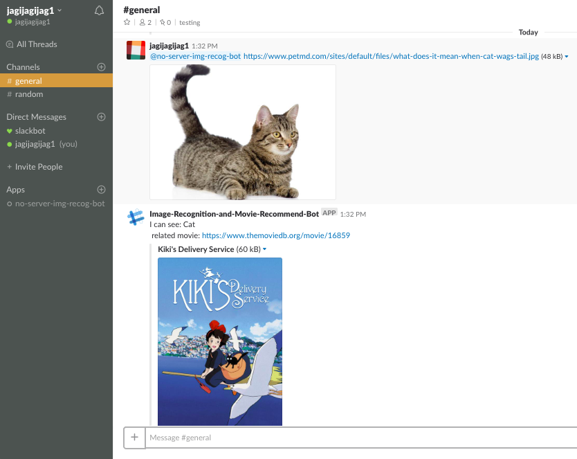
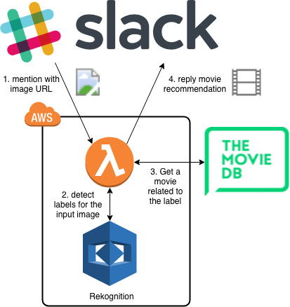

# No Server November: Nov 12, AnimalBot & Nov 19, Slack bot 

This is my challange for https://serverless.com/blog/no-server-november-challenge/, Nov 12 AnimalBot & Nov 19 Slack bot.

If you mention to the bot with image URL, the bot recommend a movie related to the image.



## System overview



## Project setup
### Requirements
- Python 3.6
- Serverless framework 1.32.0
  - serverless-python-requirements

### compile & deploy
```bash
git clone https://github.com/jagijagijag1/animal-recog-slack-bot
cd animal-recog-slack-bot
```

Describe your Slack tokens & [The Movie DB](https://www.themoviedb.org) token info to `environment` clause on `serverless.yml`.

```yaml:serverless.yml
...
functions:
  hello:
    handler: handler.main
    events:
      - http:
          path: /
          method: POST
    environment:
      OAUTH_TOKEN: <your-token>
      BOT_TOKEN: <your-token>
      MOVIE_DB_API_TOKEN: <your-token>
    timeout: 20
```

Then, run the following.

```bash
sls deploy -v
```